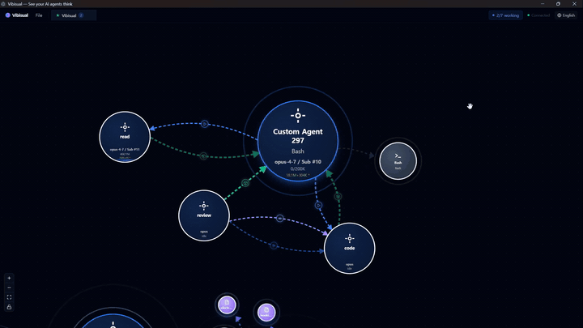

<div align="center">

# Vibisual

### See your AI agents think.

</div>



<div align="center">

Visualize agent behavior through hooks, or build your harness by placing
custom agent bubbles on a canvas.

[](LICENSE)
[](https://nodejs.org)
[](https://claude.com/claude-code)
[](#)

</div>

---

## What it does

Vibisual does two things.

### 1. Visualizes Claude Code through hooks

Supported Claude Code hook events — including `PreToolUse`, `PostToolUse`,
`UserPromptSubmit`, `SessionStart`, and others — become nodes on a live
bubble map. Sub-agent spawns become edges. Tool calls become child
bubbles. Keyword links connect related work across sessions.

The terminal output of a multi-agent Claude session is a tree printed
as a wall of text. Vibisual draws that tree as it grows.

### 2. Designs the harness as a visual graph

The bubble map is both the runtime view **and** the design surface for
your harness. Instead of editing `settings.json` in a text editor, you
build the harness on a canvas:

- **Place agents as nodes.** Drop a bubble onto the canvas to define a
  new sub-agent. Each node carries its own configuration — model,
  permission mode, tools, isolation, max turns, effort level, skills,
  and per-agent rules.
- **Wire them with edges.** Connect agents with task edges to define
  handoffs and dependencies between them. The edges become the
  control-flow graph of your harness.
- **The graph defines the harness.** In the current early release,
  Vibisual reads the graph and launches the corresponding Claude Code
  sub-agent workflow. The same canvas you designed on is the canvas
  you watch the run on.

What used to be a buried `settings.json` tree is now a workflow you can
see, edit, and rearrange at any time.

## Watch the full walkthrough

[](https://youtu.be/asJ_Z-75uqc)

▶ [Watch on YouTube — 2-minute walkthrough](https://youtu.be/asJ_Z-75uqc)

## Quick Start

### Install on Windows

1. Install the **Claude CLI** if you don't have it yet. The recommended
   path is the [official Claude Code installation guide](https://docs.claude.com/claude-code/setup).

   For npm-based installs:

   ```
   npm install -g @anthropic-ai/claude-code
   ```

   (npm install requires [Node.js ≥ 20](https://nodejs.org).)

2. Download the latest installer from the
   [Releases page](https://github.com/Vibisual/vibisual/releases/latest)
   and run it:

   ```
   Vibisual-0.1.0-setup.exe
   ```

3. Launch Vibisual.

### Build from source (contributors)

```bash
git clone https://github.com/Vibisual/vibisual.git
cd vibisual
pnpm install

# Build and launch the desktop app
node scripts/runapp.mjs

# Build a Windows installer
pnpm build:win
```

### About the hook installer

On first launch, Vibisual writes a managed hook block into
`~/.claude/settings.json` so Claude CLI sessions can stream into the
bubble map. A timestamped backup is kept next to it
(`.bak-vibisual-*`). If you'd rather wire hooks yourself, set
`VIBISUAL_SKIP_HOOK_INSTALL=1` before first launch.

Tested on Windows. macOS and Linux builds are available but not extensively tested.

## Security and privacy

Vibisual installs Claude Code hooks that can receive hook event payloads
such as prompts, tool calls, file paths, shell commands, and session
metadata.

By default, Vibisual is intended to run locally. Review the hook
configuration before use, especially in repositories containing
secrets, private code, credentials, or customer data.

Claude Code command hooks run with the permissions of your local user
account. Only install hooks from code you trust.

Vibisual creates a timestamped backup of `~/.claude/settings.json`
before writing its managed hook block. To disable automatic hook
installation, set `VIBISUAL_SKIP_HOOK_INSTALL=1` before first launch.

## License

Apache License 2.0 — see [LICENSE](LICENSE). "Vibisual" and the Vibisual logo are trademarks of the project maintainers; see [TRADEMARK.md](TRADEMARK.md) for the policy.

## Contributing

Before opening a pull request, please read [CONTRIBUTING.md](CONTRIBUTING.md). It covers the licensing terms that apply to contributions — including a DCO sign-off requirement and an additional grant that lets the project relicense contributed code for future commercial offerings.

## Disclaimer

Vibisual is an independent open-source project and is not affiliated with, endorsed by, or sponsored by Anthropic. Claude and Claude Code are trademarks of their respective owners.
