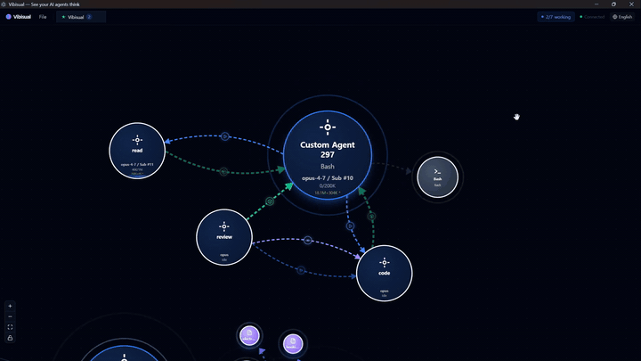

<div align="center">

# Vibisual

### The first Visual Development Environment for AI coding agents.

</div>



<div align="center">

Design your agent team on a canvas, watch them work, and edit right there.

*See your AI agents think.*

[](LICENSE)
[](https://nodejs.org)
[](https://claude.com/claude-code)
[](#)

</div>

---

## IDE → ADE → VDE

Coding agents don't type. They act — reading files, running commands,
spawning other agents. Yet the tools we watch them with are still text:
a terminal, a chat log, a list of tasks.

| | Who writes the code | What you do | Examples |
|---|---|---|---|
| **IDE** | You | **Type** it | VS Code, Cursor |
| **ADE** | The agent | **Read** the terminal | Warp |
| **VDE** | The agents | **Watch** the map | **Vibisual** |

A Visual Development Environment draws agent work as *space* instead of
text — and keeps design, execution, observation, and editing on that one
surface.

## What it does

### 1. Draws the run as a live map

Claude Code hook events — including `PreToolUse`, `PostToolUse`,
`UserPromptSubmit`, and `SessionStart` — become nodes on a live
canvas. Sub-agent spawns become edges. Tool calls become child
bubbles. Folders and files light up as they are touched.

The output of a multi-agent session is a tree printed as a wall of
text. Vibisual draws that tree as it grows.

### 2. Designs the agent team as a visual graph

The bubble map is both the runtime view **and** the design surface for
your harness. Instead of editing `settings.json` in a text editor, you
build the harness on a canvas:

- **Place agents as nodes.** Drop a bubble onto the canvas to define a
  new sub-agent. Each node carries its own configuration — model,
  permission mode, tools, isolation, max turns, effort level, skills,
  and per-agent rules.
- **Wire them with edges.** Connect agents with task edges to define
  handoffs and dependencies between them. The edges become the
  control-flow graph of your harness.
- **The graph defines the harness.** In the current early release,
  Vibisual reads the graph and launches the corresponding Claude Code
  sub-agent workflow. The same canvas you designed on is the canvas
  you watch the run on.

What used to be a buried `settings.json` tree is now a workflow you can
see, edit, and rearrange at any time.

### 3. Lets you fix things without leaving the map

Double-click a bubble and the workspace opens in place: the agent's live
stream, a file tree, a code editor with syntax highlighting, diffs, and a
terminal — all in the same window as the canvas.

You direct, the agents build, and when something needs a human hand you
fix it on the spot instead of switching to another app.

## Watch the full walkthrough

[](https://youtu.be/asJ_Z-75uqc)

▶ [Watch on YouTube — 2-minute walkthrough](https://youtu.be/asJ_Z-75uqc)

## Quick Start

### Install on Windows

Vibisual runs on top of the [Claude CLI](https://claude.com/claude-code),
which must already be installed and available on your PATH.

1. Download the latest installer from the
   [Releases page](https://github.com/Vibisual/vibisual/releases/latest)
   and run it:

   ```
   Vibisual-0.1.9-setup.exe
   ```

2. Launch Vibisual.

### Build from source (contributors)

```bash
git clone https://github.com/Vibisual/vibisual.git
cd vibisual
pnpm install

# Build and launch the desktop app
node scripts/runapp.mjs

# Build a Windows installer
pnpm build:win
```

### About the hook installer

On first launch, Vibisual writes a managed hook block into
`~/.claude/settings.json` so Claude CLI sessions can stream into the
bubble map. A timestamped backup is kept next to it
(`.bak-vibisual-*`). If you'd rather wire hooks yourself, set
`VIBISUAL_SKIP_HOOK_INSTALL=1` before first launch.

Tested on Windows. macOS and Linux builds are available but not extensively tested.

## Status

Vibisual is currently an early preview release.

This 0.1.x preview is intended for experimentation, demos, and feedback.
Expect bugs, incomplete features, rough edges, and occasional breaking
changes.

Vibisual is not recommended for critical production workflows or
repositories containing highly sensitive data.

## Security and privacy

Vibisual uses Claude Code hooks to visualize agent activity. Hook
payloads may include prompts, tool calls, file paths, shell commands,
session metadata, and other local development context.

Vibisual is currently intended for local experimentation. Review the
generated hook configuration before use, especially in repositories
containing secrets, credentials, private code, customer data, or
production systems.

Claude Code command hooks run with the permissions of your local user
account. Only install and run hooks from code you trust.

## License

Apache License 2.0 — see [LICENSE](LICENSE). "Vibisual" and the Vibisual logo are trademarks of 길근오 (the project owner); see [TRADEMARK.md](TRADEMARK.md) for the policy.

## Contributing

By contributing, you agree to the DCO sign-off requirement and the additional contribution terms described in [CONTRIBUTING.md](CONTRIBUTING.md), including permission for the project owner to relicense contributions for future commercial offerings.

## Disclaimer

Vibisual is an independent open-source project and is not affiliated with, endorsed by, or sponsored by Anthropic.

Claude, Claude Code, and Anthropic are trademarks or registered trademarks of Anthropic, PBC. All product names, logos, and brands are property of their respective owners.
